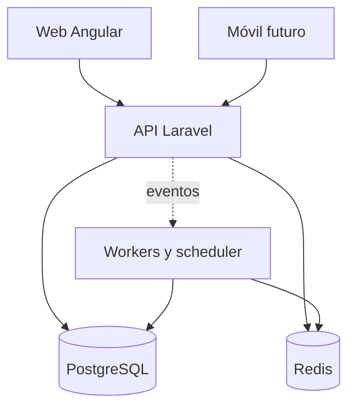
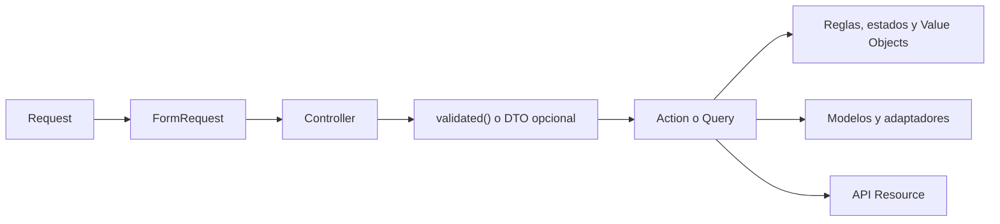

# GAM — Arquitectura objetivo

## 1. Objetivo

GAM es un sistema de gestión avícola para administrar instalaciones, lotes, producción, manejo, sanidad, inventario de huevos, repartos, ventas y cuentas corrientes.

La arquitectura objetivo es un **monolito modular con API contract-first**:

- Laravel como fuente única de reglas de negocio y Angular organizado por funcionalidades;
- PostgreSQL como base transaccional y Redis para colas, cache y rate limiting;
- una API versionada compartida por web y futuros clientes móviles;
- módulos internos con responsabilidades y datos claramente delimitados.

## 2. Principios

1. **Dominio primero:** el código representa acciones del negocio, no solamente CRUDs.
2. **Monolito modular:** una sola aplicación desplegable con límites internos fuertes.
3. **Backend autoritativo:** permisos, stock, importes y estados se validan en Laravel.
4. **Consistencia transaccional:** stock, reparto, ventas y saldos cambian de forma atómica.
5. **Contrato único:** OpenAPI define la comunicación entre backend, web y móvil.
6. **Seguridad por defecto:** toda ruta es privada salvo declaración explícita.
7. **Efectos secundarios asíncronos:** alertas y reportes se ejecutan después del commit.
8. **Modelado proporcional:** Value Objects y DTOs se usan sólo cuando protegen reglas o límites reales.

## 3. Contexto del sistema



## 4. Organización del repositorio

La estructura objetivo separa `apps/api`, `apps/web`, `contracts/openapi`, `infrastructure`, `docs/adr` y `docs/runbooks`. La aplicación móvil se agrega más adelante en `apps/mobile`.

## 5. Módulos de dominio

| Código | Módulo | Responsabilidad y entidades principales |
|---|---|---|
| M01 | Identidad y acceso | Usuarios, roles, permisos, sesiones y alcance por UP |
| M02 | Geografía y referencia | `Departamento`, `Localidad` y catálogos geográficos |
| M03 | Instalaciones | `UP`, `Galpon`, `Mantenimiento` y capacidad operativa |
| M04 | Proveedores y sanidad | `Proveedor`, `TipoP`, `Alimento`, `Medicamento`, `Sanidad`, `Vacuna`, `VacunaLote` |
| M05 | Lotes y producción | `Raza`, `Categoria`, `Division`, `Lote` y recolecciones |
| M06 | Ejecución del manejo | `Manejo`, `Peso`, `DetallePeso`, `Mortalidad` y tareas realizadas |
| M07 | Planes de manejo | `PlanDeManejo`, versiones, asignaciones y ocurrencias |
| M08 | Inventario y reparto | `Huevo`, `Reparto`, `Imprevisto`, retiros, retornos y stock |
| M09 | Clientes y ventas | `Cliente`, `Venta`, `CuentaCorriente`, `Movimiento` y cobros |
| M10 | Reportes y monitoreo | KPIs, alertas, auditoría, proyecciones y exportaciones |

### Reglas entre módulos

- Cada módulo es el único autorizado a modificar sus datos.
- Un módulo no importa controllers, requests ni modelos Eloquent internos de otro.
- La colaboración ocurre mediante Actions públicas, Queries, proyecciones o eventos.
- Un contrato público compuesto puede usar un DTO o read model inmutable, nunca un modelo Eloquent interno.
- M10 puede leer proyecciones de todos los módulos, pero no modificar sus datos.
- `Shared` contiene solamente elementos estables como `Money`, `Clock`, IDs y errores base; nunca negocio residual.

## 6. Arquitectura Laravel



```text
app/
├── Modules/
│   └── NombreModulo/
│       ├── Application/     # Actions, Queries y DTOs opcionales
│       ├── Domain/          # Reglas, estados, eventos y Value Objects
│       ├── Http/            # Controllers, Requests y Resources
│       └── Infrastructure/  # Redis y servicios externos cuando apliquen
├── Models/NombreModulo/     # Modelos Eloquent propiedad del módulo
├── Casts/NombreModulo/      # Custom casts de Eloquent
├── Policies/NombreModulo/   # Autorización Laravel
├── Providers/               # Registro de módulos e integraciones
└── Shared/                  # Money, Clock, IDs y errores base

tests/
├── Feature/NombreModulo/    # Contrato HTTP e integración
└── Unit/NombreModulo/       # Actions, reglas y Value Objects
```

### Reglas de implementación

- El controller sólo adapta HTTP y entrega a la Action datos validados, nunca el Request completo.
- El `FormRequest` valida estructura y tipos.
- La Action representa un único caso de uso y controla el límite transaccional.
- Las invariantes viven en Domain/Application.
- Los modelos Eloquent representan persistencia, identidad, relaciones y casts.
- Los modelos viven en `app/Models/<Modulo>` siguiendo Laravel, nunca en `Http/Models`.
- Los tests viven en `tests/Feature/<Modulo>` y `tests/Unit/<Modulo>`, nunca dentro de `app`.
- Los Resources definen la salida JSON; no validan entradas ni reemplazan Value Objects o DTOs.
- Los eventos se publican únicamente después del commit.
- No se crea un repositorio genérico para cada tabla.

### Value Objects

- Un Value Object es inmutable, no tiene ID y encapsula reglas asociadas a un valor.
- `Money` se usa para precios, totales, débitos, créditos y saldos.
- `CantidadHuevos` puede normalizar unidades, docenas o bandejas a huevos individuales.
- `Peso` y `Dosis` se usan sólo si existen conversiones o reglas que lo justifiquen.
- Eloquent persiste el dato y puede exponer el Value Object mediante custom casts o accessors.
- No se convierte cada string o entero en Value Object sin una invariante concreta.

`Money` pertenece a `Shared`; `CantidadHuevos`, `Peso` y `Dosis` permanecen en el módulo dueño de ese concepto.

### DTOs

- Los DTOs no se crean por defecto ni duplican cada `FormRequest` o modelo.
- Una entrada simple puede pasar como array validado o parámetros tipados a la Action.
- Se usan para comandos críticos con datos anidados, múltiples líneas o varios orígenes, y para contratos públicos entre módulos.
- Deben ser inmutables, específicos del caso de uso y no espejos genéricos de tablas.
- Aplican a casos como `RegistrarVentaData` o `CerrarRepartoData`, no a entradas simples como crear una UP.

## 7. Arquitectura Angular

Angular se divide en `core` para autenticación/API, `shared` para UI reutilizable y `features` alineados con los módulos de GAM.

- Las rutas de features se cargan de forma lazy.
- Angular consume un cliente tipado generado desde OpenAPI.
- Guards y botones ocultos mejoran la UX, pero no reemplazan la autorización del backend.
- Signals/RxJS manejan estado local; la UI no calcula saldos ni decide transiciones críticas.
- La PWA puede cachear assets públicos, nunca respuestas privadas sin una política explícita.

## 8. Flujos e invariantes críticas

### Recolección

Registrar una recolección y aumentar el inventario debe ocurrir en la misma transacción. `CantidadHuevos` normaliza la cantidad antes de modificar stock. Un reintento con la misma clave idempotente no puede duplicar huevos.

### Reparto

1. Crear el reparto en borrador.
2. Bloquear el saldo relevante con `lockForUpdate`.
3. Recalcular y validar la disponibilidad.
4. Reservar stock dentro de la misma transacción.
5. Iniciar, conciliar y cerrar mediante transiciones explícitas.

Retiros y retornos operan con cantidades normalizadas. Nunca se crea un reparto operativo con stock insuficiente o negativo.

### Venta y cuenta corriente

- Una venta no supera lo disponible en su reparto.
- Precios, totales, débitos, créditos y saldos se calculan en servidor usando `Money`.
- Confirmar una venta genera un débito en cuenta corriente.
- Registrar un cobro mayor que cero genera un crédito separado; el estado de pago deriva del saldo.
- Una anulación crea contramovimientos y conserva el registro original.

### Plan y manejo

- Un plan se asigna explícitamente a cada lote.
- Una versión publicada del plan es inmutable.
- M07 programa la actividad y M06 registra su ejecución sin modificar históricos.

## 9. Datos y concurrencia

- Dinero se almacena como `DECIMAL` y se transporta como string o `Money`, nunca como `float`; sus casts conservan la precisión.
- El inventario de huevos usa una unidad canónica; la unidad ingresada se conserva si es necesaria para auditoría.
- Pesos y dosis usan `DECIMAL` y una unidad explícita; se normalizan sólo cuando el negocio lo requiere.
- Inventario y cuenta corriente se basan en movimientos inmutables.
- FKs, índices, uniques y checks protegen invariantes; el stock usa transacciones y locks.
- Mutaciones críticas aceptan `Idempotency-Key`.
- Los registros confirmados se corrigen mediante compensación, no eliminación.
- Redis no reemplaza a PostgreSQL como fuente de verdad.

## 10. Seguridad

- Web: Sanctum stateful, CSRF y cookie `HttpOnly`, `Secure` y `SameSite`.
- Móvil futuro: tokens revocables, expirables y con capacidades limitadas.
- Autorización server-side mediante roles, permisos, Policies y alcance de UP.
- Usuarios o permisos inactivos nunca conceden acceso.
- CORS usa orígenes explícitos; login y recuperación tienen rate limiting.
- Secrets permanecen fuera del repositorio.
- Logs no incluyen secretos; permisos, stock, repartos, ventas y cobros quedan auditados.

## 11. Contrato API

- La base es `/api/v1` y OpenAPI es la fuente del contrato.
- Errores homogéneos mediante `application/problem+json`.
- Los Resources convierten modelos y Value Objects a tipos definidos por OpenAPI.
- Listados paginados y con límites máximos.
- Comandos expresan acciones: `POST /repartos/{id}/iniciar`.
- Estados principales: `401`, `403`, `404`, `409`, `422` y `429`; los cambios incompatibles requieren nueva versión o deprecación.

## 12. Colas, operación y calidad

- Outbox transaccional para publicar eventos confiablemente.
- Colas separadas: `critical`, `default` y `reporting`.
- Jobs idempotentes con timeout, reintentos, backoff y dead-letter.
- Logs estructurados con `trace_id`, usuario, módulo, UP y resultado.
- Health checks separados para liveness y readiness.
- Métricas de HTTP, PostgreSQL, colas, stock, conciliaciones y tareas vencidas.
- Backups cifrados con pruebas periódicas de restauración.

## 13. Despliegue

### Procesos desplegables

- `gateway`: TLS, routing y rate limiting.
- `web`: API stateless.
- `worker`: colas asíncronas.
- `scheduler`: tareas periódicas.

La infraestructura objetivo separa servidor HTTP, workers y scheduler. La imagen debe construirse en múltiples etapas, instalar dependencias desde lockfiles y ejecutarse sin privilegios.

Los despliegues usan migraciones expand/contract, health checks y artefactos inmutables. PostgreSQL es el motor transaccional objetivo; cambiar de motor requiere un ADR y una justificación concreta.
